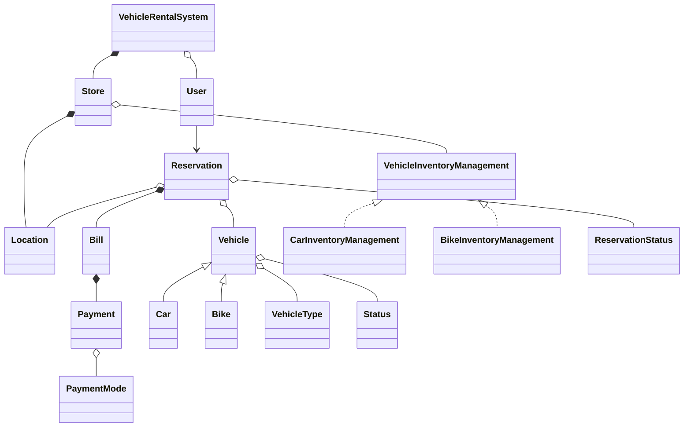

## Embedded Design Patterns Explained

### 1. **Strategy Pattern**
- **Where:**  
  - `VehicleInventoryManagement` (interface/abstract)  
    → `CarInventoryManagement`, `BikeInventoryManagement` (implementing/deriving classes)
- **Intent:**  
  - Strategy allows the system to select the inventory management algorithm for cars or bikes at runtime, keeping management logic extensible and replaceable.

### 2. **Inheritance (OOP)**
- **Where:**  
  - `Vehicle <|-- Car`  
  - `Vehicle <|-- Bike`
- **Intent:**  
  - Base class (`Vehicle`) lets cars and bikes share common attributes/behavior but specialize as needed.

### 3. **Composition**
- **Where:**  
  - `VehicleRentalSystem *-- Store`  
  - `Store *-- Location`  
  - `Reservation *-- Bill`  
  - `Bill *-- Payment`
- **Intent:**  
  - "Has-a" relationships. Lifetime of part is managed by parent. E.g., a store cannot exist without a system.

### 4. **Aggregation**
- **Where:**  
  - `VehicleRentalSystem o-- User`  
  - `Store o-- VehicleInventoryManagement`  
  - `Reservation o-- Vehicle`  
  - `Reservation o-- Location`
- **Intent:**  
  - "Uses-a" relationships—parts can exist independently.

### 5. **Association**
- **Where:**  
  - `User --> Reservation`
- **Intent:**  
  - Simple links, representing user action to make a reservation.

### 6. **Enum Aggregation**
- **Where:**  
  - Vehicles, Reservations, Payments are linked with property/status enums: `VehicleType`, `Status`, `ReservationStatus`, `PaymentMode`
- **Intent:**  
  - Assign states/types to objects, making system more robust and readable.

---
