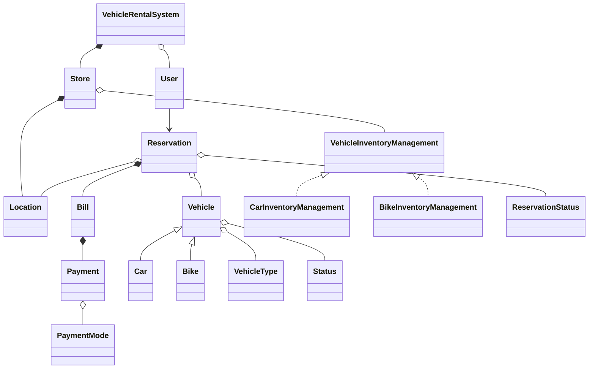

## Relationship Explanations

- **Composition:**  
  - `VehicleRentalSystem *-- Store`: System owns Stores  
  - `Store *-- Location`: Store has Location  
  - `Reservation *-- Bill`: Reservation creates Bill  
  - `Bill *-- Payment`: Bill generates Payment  

- **Aggregation:**  
  - `VehicleRentalSystem o-- User`: System manages Users  
  - `Store o-- VehicleInventoryManagement`: Store uses Inventory  
  - `Reservation o-- Vehicle`: Reservation uses Vehicle  
  - `Reservation o-- Location`: Pickup Location  

- **Association:**  
  - `User --> Reservation`: User makes Reservations

- **Inheritance & Strategy Pattern:**  
  - `Vehicle <|-- Car`, `Vehicle <|-- Bike`: Car/Bike inherit Vehicle  
  - `VehicleInventoryManagement <|.. CarInventoryManagement`, `VehicleInventoryManagement <|.. BikeInventoryManagement`: Strategy Pattern

- **Enum aggregation:**  
  - `Vehicle o-- VehicleType`, `Vehicle o-- Status`,  
  - `Reservation o-- ReservationStatus`, `Payment o-- PaymentMode`
